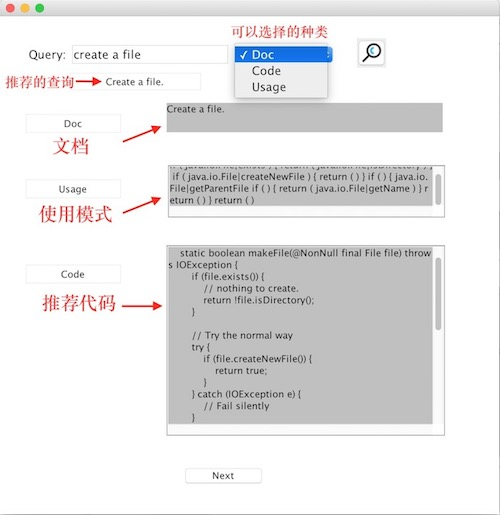

# Api-code_searcher

A tool to search api usage pattern and code.
一款为了方便开发人员使用的API和代码推荐的工具

## 数据介绍

数据放在了ACT实验室下的elastic search服务器上（内网地址: 192.168.7.101:5601），数据源为近40万的java函数数据，是从Github上的真实java代码中提取而来。每一条数据包括code、doc、usage、sentence部分。


## 界面介绍

如下图所示，上面的可选的菜单是Doc、Code和Usage, 用户可以根据自己的需要去查询相关的内容进行搜索。在返回结果里，用户可能比较关注的是usage(API用法模式)和code，它是数据集里用户匹配度最高的实例，而上面的Doc则是这条实例里该用户所填写的Doc。点击最下面的next按钮可以查看更多不同的usage pattern 和 code。




## 环境配置

1. jdk1.8
2. **目前的数据源放在ACT实验室内网环境下，故只有在内网环境才可以使用**

## demo展示

https://youtu.be/ObOvYbuAbVM

## 文件说明
    
    
```
project
│   readme.md
│   code-search-1.0.jar 最终生成的jar包
|
└───act_swing/ 存放java工程
│   │   pom.xml maven项目的依赖集合
│   └───src/
│   └───target/ maven项目的输出目录，其中包括了我们的jar文件(可以通过mvn package命令生成）
└───images/ 存放jar包的截图
|   │   api-code-recommend.jpg
│   


   
```

其中代码文件为：

```
└───src/ java源代码
│   └───buaa/act/
│   |   └───ApiWork.java 主要完成各种搜索相关功能
|   |   └───ESConnection.java 连接ES的单例模式
|   |   └───App.java Swing项目文件
|   |   └───Hierachical.java 凝聚层次聚类，其中距离的更新方式为CompleteLinkage(类之间的最大距离）
|

```

